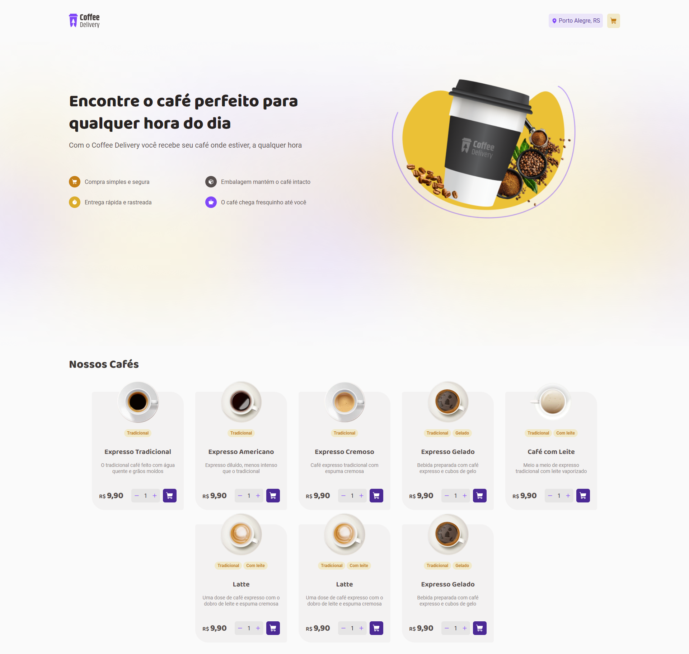

<h1 align="center"> Coffee Delivery | Ignite </h1>

Projeto desenvolvido através de um desafio do 2º módulo "Criando SPA's com ReactJS" do programa Ignite da Rocketseat 

  <a href="#-tecnologias">Tecnologias</a>&nbsp;&nbsp;&nbsp;|&nbsp;&nbsp;&nbsp;
  <a href="#-projeto">Projeto</a>&nbsp;&nbsp;&nbsp;|&nbsp;&nbsp;&nbsp;
  <a href="#-licença">Licença</a>

  

  <a href="https://ignite-coffee-delivery-nine.vercel.app/" target="_blank">➡️ Acesse o deploy!</a>

## 🚀 Tecnologias

Esse projeto foi desenvolvido com as seguintes tecnologias:

- React
- ContextAPI
- StyledComponents
- Typescript
- Vite

## 💻 Projeto

O projeto é um app que vende cafés. Na 1o página temos uma listagem de cafés. O usuário pode escolher o café e uma quantidade e adicionar ao carrinho. Com isso temos uma página de checkout que lista e permite mudanças para então finalizar a compra e redirecionar para a página de sucesso. Onde é exibido o endereço cadastrado no checkout e informações sobre o pedido.

Os principais objetivos do projeto eram:

[x] Listagem de produtos (cafés) disponíveis para compra

[x] Adicionar uma quantidade específicas de itens no carrinho

[x] Aumentar ou remover a quantidade de itens no carrinho

[x] Formulário para o usuário preencher o seu endereço

[x] Exibir o total de itens no carrinho no Header

[x] Exibir o valor total da soma de itens no carrinho multiplicados pelo valor

## 🔘 Licença

Esse projeto está sob a licença MIT.

---

Made with 💙 by Rafael Ramos
